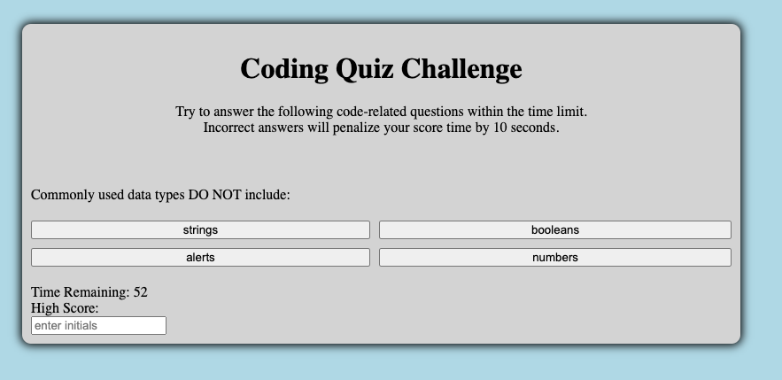

<h1>Coding Quiz</h1>
<h2>John Manouse</h2>

I created a Coding Quiz that will populate questions, with multiple choice answers, and a coundown timer. The questions will populate the form field on the screen along with buttons for the multiple choice answers. If the user chooses a correct answer, the quiz will show "Correct Answer" and load the next question. If the user chooses an incorrect answer, the the quiz will show "Incorrect Answer," deduct ten seconds of time and load the next question.

  Once all 5 questions have loaded, and been answered, or the timer reaches zero, the quiz will be ended. Users can input their initials to save their score which is stored in local storage.

 

<h2>Coding Quiz</h2>
<ul>
    <li>HTML code</li>
    <li>CSS</li>
    <li>Javascript</li>
</ul>

<h2>Pull Requests welcome for contribution</h2>

John Manouse

Live Link: <a href="https://mirageg4.github.io/CodingQuiz/.">Coding Quiz</a>

Github: <a href="https://github.com/Mirageg4/CodingQuiz/">Coding Quiz Repo</a>

              

License: Project is licensed under the MIT License. 
See <a href ="LICENSE.md">LICENSE</a> file for details.

